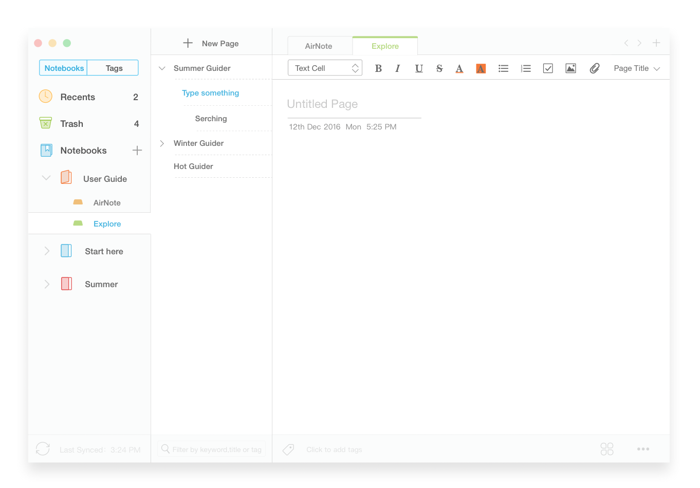

This project is *deprecated*, no longer be maintained any more。

New project has been created there: https://github.com/sikaco/Universal-Note

---

# AirNote


A note app just like air, concise but necessary.

## Develop

### Run
```
npm start
```

### EcmaScript 6 default
Default version of complied js code is es6. If you want to transform it to es5 (e.g: run in ie), please add code below to `.babelrc`.
```
"presets": [
  ["es2015", {"modules": false}]
],
```

## Practice principle

### Common
1. Functional component in priority.
1. Export store's singleton with `default export`.

### Type
1. No `<any>` except of `types` folder.
1. Avoid `<any>` in `types` folder as much as possible.
1. Not add prefix `I` to interface declare which in `types`
